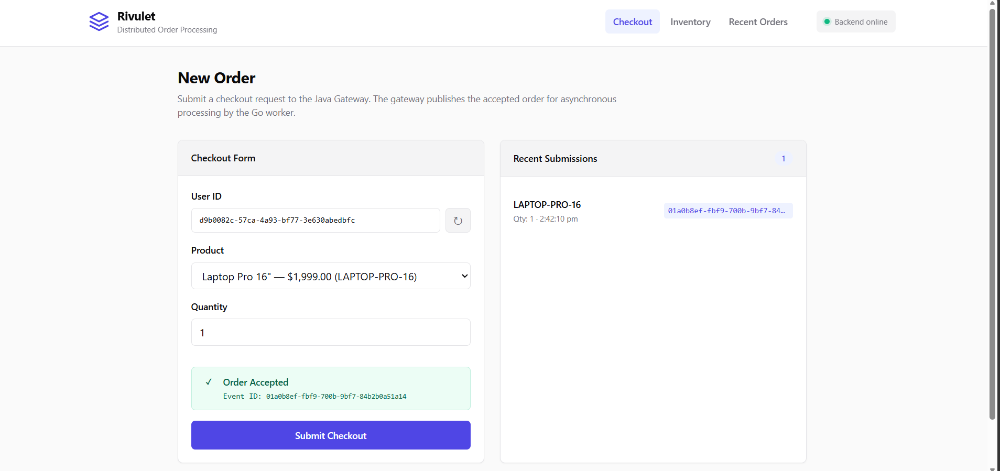

# Rivulet Frontend

A production-grade React 19 + TypeScript single-page application for the Rivulet distributed order processing platform. Built with Vite, served by nginx-unprivileged, and instrumented with OpenTelemetry Web SDK for end-to-end browser-to-database trace correlation.

This service is the **trace originator** — every distributed trace in OpenObserve begins with a user interaction in this UI.

---



---

## Architecture

```sh
┌─────────────────────────────────────────────────────────────────┐
│  Browser                                                        │
│  ┌─────────────┐  ┌──────────────────┐  ┌───────────────────┐  │
│  │ React 19 UI │  │ OTel Web SDK     │  │ W3C traceparent   │  │
│  │ (Vite 8)    │  │ (auto-instrument)│  │ (injected header) │  │
│  └──────┬──────┘  └──────────────────┘  └───────────────────┘  │
│         │ fetch(/orders/.../checkout)                           │
└─────────┼───────────────────────────────────────────────────────┘
          │
┌─────────▼───────────────────────────────────────────────────────┐
│  nginx-unprivileged (:8080 inside container)                    │
│                                                                 │
│  /orders/*     → proxy_pass ${BACKEND_URL}/orders/*             │
│  /inventory/*  → proxy_pass ${BACKEND_URL}/inventory/*          │
│  /healthz      → proxy_pass ${BACKEND_URL}/healthz              │
│  /readyz       → proxy_pass ${BACKEND_URL}/readyz               │
│  /assets/*     → 1yr cache (hashed filenames)                   │
│  /*            → try_files → /index.html (SPA fallback)        │
│                                                                 │
│  Forwards: traceparent, tracestate, X-Request-ID, baggage       │
└─────────┬───────────────────────────────────────────────────────┘
          │
┌─────────▼───────────────────────────────────────────────────────┐
│  Java Gateway (Spring Boot 4.1.1, :8080)                        │
│  → Valkey Stream → Go Worker → PostgreSQL                       │
└─────────────────────────────────────────────────────────────────┘
```

---

## Tech Stack

| Layer             | Technology            | Version | Purpose                                                        |
| ----------------- | --------------------- | ------- | -------------------------------------------------------------- |
| **Framework**     | React                 | 19.3.0  | UI components with concurrent features                         |
| **Language**      | TypeScript            | 5.9.3   | Strict type checking (max supported by typescript-eslint 8.70) |
| **Build**         | Vite                  | 8.3.0   | ESBuild-based bundler with HMR                                 |
| **Routing**       | React Router          | 8.4.0   | Data router with `RouterProvider` from `react-router/dom`      |
| **Observability** | OpenTelemetry Web SDK | 2.11.0  | Browser tracing with W3C propagation                           |
| **Linting**       | ESLint                | 10.10.0 | Flat config with typescript-eslint + react-hooks               |
| **Runtime**       | nginx-unprivileged    | 1.30.4  | Non-root reverse proxy (UID 101)                               |
| **Builder**       | Node.js Alpine        | 22.12   | LTS for reproducible builds                                    |

---

## Project Structure

```bash
rivulet/frontend/
├── Dockerfile                    # Multi-stage: Node 22 build → nginx-unprivileged
├── nginx.conf.template           # envsubst template (${BACKEND_URL} substitution)
├── eslint.config.js              # ESLint flat config
├── index.html                    # Entry point (no runtime config injection)
├── package.json                  # Dependencies with engines >=22.12.0
├── tsconfig.json                 # Strict TypeScript (noUncheckedIndexedAccess)
├── vite.config.ts                # Dev proxy + build config
├── ci.sh                         # CI gate: typecheck + lint + build
├── test_e2e_locally.sh           # Full-stack battle test (all 3 services)
├── .dockerignore                 # Excludes node_modules, dist, tests
└── src/
    ├── main.tsx                  # OTel init (before React) + RouterProvider
    ├── App.tsx                   # Shell: header, nav, backend health polling
    ├── api.ts                    # Typed fetch wrapper with OTel spans
    ├── telemetry.ts              # OTel Web TracerProvider + instrumentations
    ├── styles.css                # Design system (CSS custom properties)
    ├── pages/
    │   ├── Checkout.tsx          # POST /orders/{userId}/checkout
    │   ├── Inventory.tsx         # GET /inventory/{sku} with AbortController
    │   └── Orders.tsx            # Client-side order history (localStorage)
    └── components/
        ├── CheckoutForm.tsx      # Form with idempotency key lifecycle
        └── RouterErrorElement.tsx # React Router error boundary
```

---

## Contracts

### API Contract with Java Gateway

| Endpoint                    | Method | Request                                   | Response          | Status Codes  |
| --------------------------- | ------ | ----------------------------------------- | ----------------- | ------------- |
| `/orders/{userId}/checkout` | POST   | `{sku, quantity}` + `X-Request-ID` header | `{eventId}`       | 202, 400, 409 |
| `/inventory/{sku}`          | GET    | —                                         | `{sku, quantity}` | 200, 404      |
| `/healthz`                  | GET    | —                                         | `ok`              | 200, 503      |
| `/readyz`                   | GET    | —                                         | `ok`              | 200, 503      |

### Idempotency Key Lifecycle

The `CheckoutForm` manages `X-Request-ID` with careful semantics:

1. **Generated** via `crypto.randomUUID()` on first submit
2. **Retained** on network failure — retrying the same payload uses the same key (idempotent)
3. **Invalidated** when form fields change — a different payload gets a new key
4. **Cleared** on successful submission

This prevents both duplicate submissions and accidental reuse of a key for a different order.

### Two Configuration Surfaces (Critical Distinction)

| Surface                   | When Applied      | How                                          | Example                                  |
| ------------------------- | ----------------- | -------------------------------------------- | ---------------------------------------- |
| **`VITE_*` env vars**     | Build time        | Inlined into JS bundle via `import.meta.env` | `VITE_OTEL_ENDPOINT`, `VITE_GIT_VERSION` |
| **`BACKEND_URL` env var** | Container startup | Substituted into nginx config via `envsubst` | `BACKEND_URL=http://java-gateway:8080`   |

**Why this matters:** Vite's `VITE_*` variables are compile-time constants — they cannot be changed after `npm run build`. The Java Gateway URL must be runtime-configurable (different in Kind vs AKS), so it uses nginx's `envsubst` template mechanism instead.

---

## Observability

### OTel Web SDK Instrumentations

| Instrumentation                  | What It Captures                                            |
| -------------------------------- | ----------------------------------------------------------- |
| `FetchInstrumentation`           | All `fetch()` calls with W3C `traceparent` header injection |
| `DocumentLoadInstrumentation`    | Page load timing (DNS, TCP, TTFB, render)                   |
| `UserInteractionInstrumentation` | Click and submit events as spans                            |

### Trace Flow

```sh
User clicks "Submit Checkout"
  │
  ▼
[UserInteraction span] — click event
  │
  ▼
[checkout_request span] — api.checkout()
  │  injects: traceparent, tracestate, X-Request-ID
  ▼
[fetch span] — POST /orders/.../checkout
  │
  ▼
nginx proxy_pass (forwards all trace headers)
  │
  ▼
Java Gateway [process_checkout span]
  │  XADD with W3C context in stream message
  ▼
Go Worker [process_order_event span]
  │  atomic DB transaction
  ▼
PostgreSQL
```

All spans share the same `trace_id`, enabling full browser-to-database correlation in OpenObserve.

---

## Local Development

### Prerequisites

- Node.js >= 22.12.0
- Docker (for E2E tests)
- Running Kind cluster with `rivulet` and `openobserve` namespaces

### Development Server

```bash
cd /workspace/rivulet/frontend

# Install dependencies
npm ci

# Start dev server with API proxy to local Java Gateway
VITE_BACKEND_URL=http://localhost:18080 npm run dev
```

Vite's dev proxy routes `/orders/*`, `/inventory/*`, `/healthz`, `/readyz` to the backend URL. All other paths serve the SPA.

### CI Gate

```bash
bash rivulet/frontend/ci.sh
```

Runs: `npm ci` → `tsc --noEmit` → `eslint .` → `vite build` → verifies `dist/` output.

### Full-Stack E2E Test

```bash
bash rivulet/frontend/test_e2e_locally.sh
```

Orchestrates **all 3 services** + Kind cluster infrastructure:

1. Starts port-forwards to Kind (Postgres, Valkey, OTel Collector, OpenObserve)
2. Builds Go worker binary, Java Gateway JAR, Frontend Docker image
3. Starts Go Worker (native binary on :18082)
4. Starts Java Gateway (native JAR on :18080)
5. Starts Frontend container (nginx on :18090 → proxies to Java Gateway)
6. Runs 7 verification tests:
   - Frontend serves HTML
   - Full-stack checkout (Frontend → Java → Valkey → Go → DB)
   - `/healthz` proxy
   - `/inventory` proxy
   - Cross-service trace correlation in OpenObserve
   - Chaos endpoints on both backends
   - SPA fallback for client-side routes
7. **Services stay running** for browser interaction

**Open in browser:**

- Frontend: http://127.0.0.1:18090
- OpenObserve: http://127.0.0.1:15080

**Cleanup:**

```bash
bash rivulet/frontend/test_e2e_locally.sh --cleanup
# OR press Ctrl+C in the script's terminal
```

---

### Docker Build

```bash
docker build \
  --build-arg VITE_GIT_VERSION=$(git rev-parse --short HEAD) \
  --build-arg VITE_ENVIRONMENT=production \
  --build-arg VITE_OTEL_ENDPOINT=https://otel-collector.example.com/v1/traces \
  -t rivulet/frontend:latest \
  .
```

The multi-stage Dockerfile:

1. **Builder stage** (Node 22 Alpine): `npm ci` → `npm run build` with `VITE_*` args baked in
2. **Runtime stage** (nginx-unprivileged): Copies `dist/` + `nginx.conf.template`

Final image: ~45MB, runs as UID 101 (nginx user), no shell or package manager.

### Container Runtime

```bash
docker run -d \
  --name rivulet-frontend \
  -p 8080:8080 \
  -e BACKEND_URL=http://java-gateway:8080 \
  rivulet/frontend:latest
```

The `BACKEND_URL` env var is substituted into `nginx.conf.template` at startup by nginx's built-in `envsubst` mechanism. The `NGINX_ENVSUBST_FILTER` env var restricts substitution to only `BACKEND_URL`, preventing accidental replacement of nginx variables like `$host` and `$uri`.

---

## Security

| Measure                      | Implementation                                                                                                     |
| ---------------------------- | ------------------------------------------------------------------------------------------------------------------ |
| **Non-root runtime**         | `nginxinc/nginx-unprivileged` runs as UID 101                                                                      |
| **No shell**                 | Alpine slim variant has no bash/sh in runtime stage                                                                |
| **Security headers**         | `X-Frame-Options`, `X-Content-Type-Options`, `Referrer-Policy`, `Permissions-Policy`                               |
| **Server tokens off**        | nginx version hidden from response headers                                                                         |
| **Aggressive asset caching** | `/assets/*` served with `Cache-Control: public, max-age=31536000, immutable` (safe due to Vite's hashed filenames) |
| **HTML never cached**        | `index.html` served with `no-cache, no-store, must-revalidate` to prevent stale deployments                        |
| **Chaos port hidden**        | Port 18081/18083 (chaos injection) never exposed via Kubernetes Service or Ingress                                 |

---

## Known Limitations

1. **OTel Web SDK requires CORS**: The OTLP collector must allow browser-origin requests. If the collector is on a different origin, configure `Access-Control-Allow-Origin` headers.

2. **No server-side rendering**: This is a pure SPA. Initial page load requires JS execution — not suitable for SEO-critical pages (acceptable for an internal platform tool).

3. **Client-side order history**: The Orders page stores history in `localStorage` — it does not query the backend for processed orders. This is intentional (avoids adding a query endpoint to the Java Gateway) but means history is per-browser and per-device.

4. **Vite build-time config**: Changing `VITE_OTEL_ENDPOINT` requires a full rebuild. For runtime-configurable OTel endpoints, you'd need to fetch config from an API endpoint at startup instead of using `import.meta.env`.

5. **TypeScript 5.9.3, not 7.x**: Pinned to 5.9.3 because `typescript-eslint` 8.70 officially supports TypeScript `<6.1.0`. Upgrading to TS 7 would break the linting stack.
